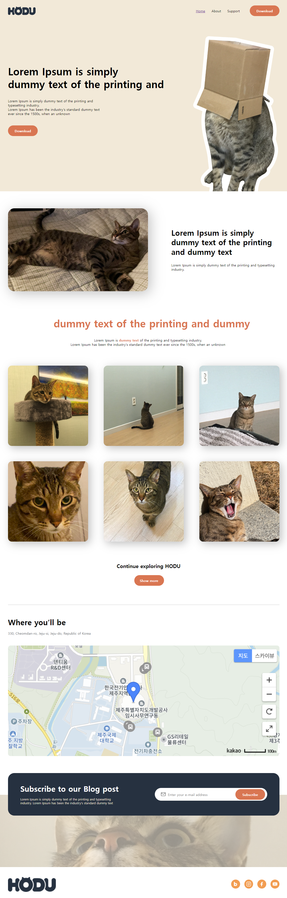
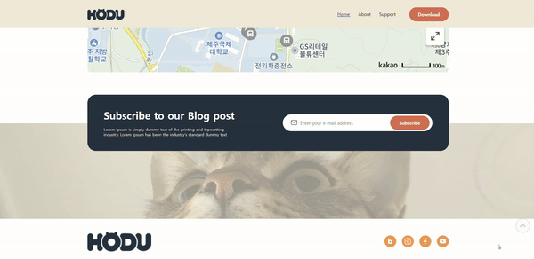

# 오르미 1차 프론트엔드 프로젝트

## 1. 프로젝트 목표 및 기능

## 1.1 프로젝트 목표
* 제공된 '호두' 템플릿과 명세서를 웹페이지를 작성한다.
* 프론트엔드 기술을 습득, 활용해 웹개발자가 되기 위한 능력을 향상시킨다.

## 1.2 프로젝트 기능
* 탑 스크롤 버튼 구현, 스크롤이 최상단에 위치 시 버튼 감추기
* 이메일 유효성을 검사, 모달 창 구현

## 2. 개발 환경 및 배포 URL

### 2.1 개발 환경

* 도구
    * Visual Studio Code
    * Figma
* 개발 스택
    * HTML
    * CSS
    * JavaScript
* 배포
    * GitHub Page

### 2.2 배포 URL

* GitHub Page : https://junsik2.github.io/

## 3. 프로젝트 구조

┃ 📂ormi-fe-project
┃ ┣ 📂js
┃ ┃ ┣ 📜script.js
┃ ┣ 📂css
┃ ┃ ┣ 📜styles.css
┃ ┃ ┣ 📜mobile.css
┃ ┃ ┣ 📜reset.css
┃ ┣ 📂images
┃ ┣ 📜index.html

## 4. 화면 구조
|PC화면|모바일화면|
|:---:|:---:|
|</img>|</img>|
|이메일 유효성 검증 & 모달 창 구현|
|제</img>|내용|
|사이드버튼|오른쪽정렬|
|제목|내용|

## 