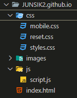

# 오르미 1차 프론트엔드 프로젝트

## 1. 프로젝트 목표
* 제공된 '호두' 템플릿에 맞춰 웹페이지를 작성한다.
* 프론트엔드 기술을 습득, 활용해 웹개발자가 되기 위한 능력을 향상시킨다.

## 2. 개발 환경 및 배포 URL

### 2.1 개발 환경
* 개발 스택
    * HTML, CSS, JavaScript
* 배포
    * GitHub Page

### 2.2 배포 URL
* GitHub Page : https://junsik2.github.io/

## 3. 프로젝트 구조
</img>

## 4. 화면 구조
|PC화면|모바일화면|
|:---:|:---:|
|왼쪽정렬|오른쪽정렬|
|제목|내용|
|:---:|:---:|
|왼쪽정렬|오른쪽정렬|
|제목|내용|
|:---:|:---:|
|왼쪽정렬|오른쪽정렬|