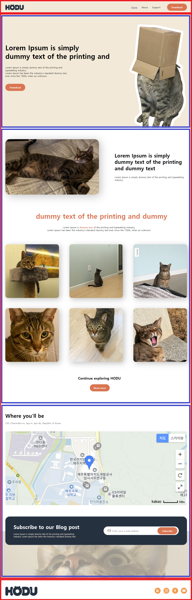

# 오르미 1차 프론트엔드 프로젝트

## 1. 프로젝트 목표 및 기능

### 1.1 프로젝트 목표
* 제공된 템플릿과 명세서를 활용해 웹페이지를 작성한다.
* 프론트엔드 기술을 습득하여 웹개발자가 되기 위한 능력을 키운다.

### 1.2 프로젝트 주요 기능
* 탑 스크롤 버튼 구현, 스크롤이 최상단에 위치 시 버튼 감추기
* 이메일 유효성을 검사, 모달 창 구현
* 사이드 메뉴 바 구현
* 카카오맵 API 사용

## 2. 개발 환경 및 배포 URL

### 2.1 개발 환경
* 도구
    * Visual Studio Code
    * Figma
* 개발 스택
    * HTML
    * CSS
    * JavaScript
* 배포
    * GitHub Page

### 2.2 배포 URL
* GitHub Page : https://junsik2.github.io/

## 3. 프로젝트 구조
* 폴더 트리
📦JUNSIK2.github.io  
 ┣ 📂css  
 ┃ ┣ 📜mobile.css  
 ┃ ┣ 📜reset.css  
 ┃ ┗ 📜styles.css  
 ┣ 📂images  
 ┣ 📂js  
 ┃ ┗ 📜script.js  
 ┗ 📜index.html  

## 4. 화면 구조
|PC 화면|모바일 화면|
|:---:|:---:|
|</img>|</img>|
|유효성 검증 & 모달 창|탑 스크롤|
|</img>|</img>|
|사이드 바||
|</img>||

## 5. 에러 및 해결
* <form> 내부에서 'submit' 버튼 클릭 시 새로고침을 강제하는 기능이 있는데 이를 방지하기위해 event.preventDefault() 메소드를 추가했습니다.

## 6. 개발하며 느낀점
* 
